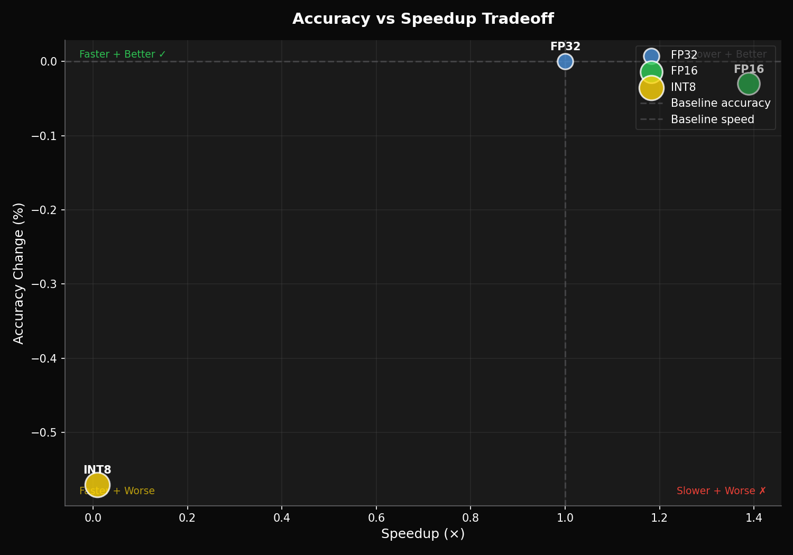
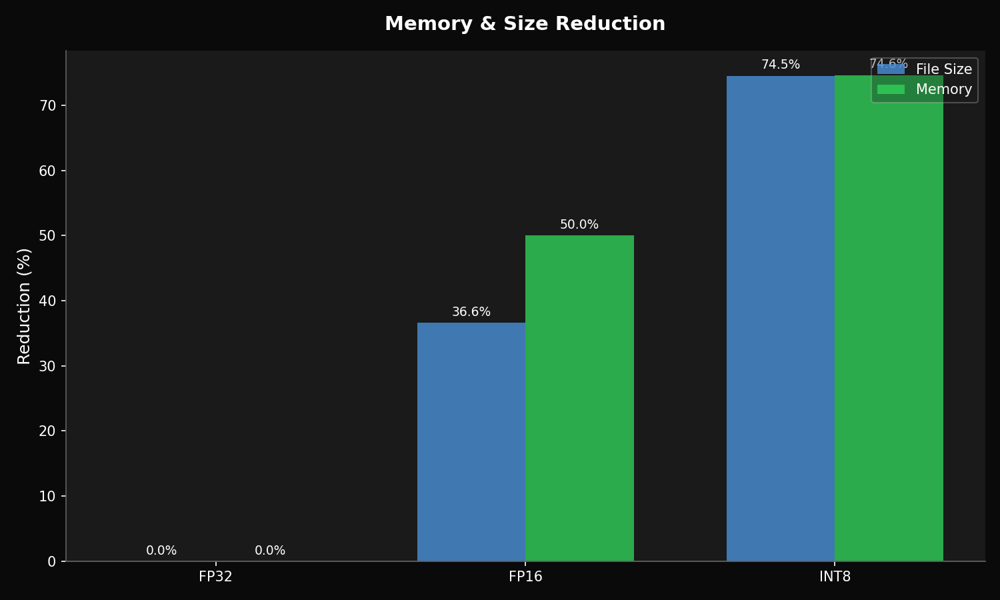

# Quantization Impact Report: resnet50_fp32

**Baseline**: FP32

## Trade-off Analysis

- **Best Balance**: FP16
- **Fastest**: FP16
- **Smallest**: INT8

### Recommendations

- **FP16** offers 1.4x speedup with minimal accuracy loss (-0.03%) - recommended.
- **FP16** saves 50% memory — ideal for edge/mobile deployment.
- **INT8** saves 75% memory — ideal for edge/mobile deployment.

### Accuracy vs Speedup

### Memory Savings

## Variant Comparison

| Precision | Size | Params | FLOPs | Speedup | Δ Accuracy |
|-----------|------|--------|-------|---------|------------|
| FP32 | 102.58 MB | 25.63M | 7.72G | 1.00x | baseline |
| FP16 | 65.03 MB | 25.63M | 7.72G | 1.39x | -0.03% |
| INT8 | 26.13 MB | 25.63M | 18.88K | 0.01x | -0.57% |

## Calibration Recommendations

- ! **Use TensorRT EP for INT8 GPU inference**
  - ONNX Runtime's CUDA EP lacks optimized INT8 kernels, falling back to CPU
- i **Alternative: Export to TensorRT engine for native INT8 GPU**
  - TensorRT has full INT8 GPU kernel support with tensor cores

---
*Generated by HaoLine Compare Mode*
